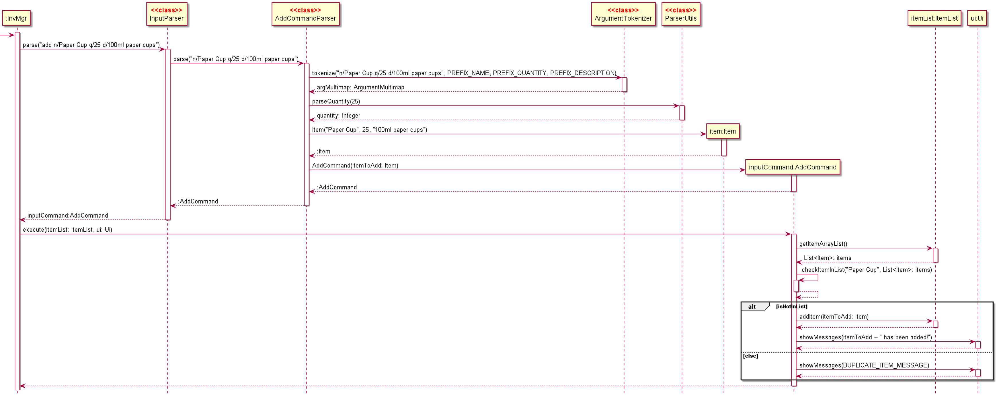

# Developer Guide

## Acknowledgements

{list here sources of all reused/adapted ideas, code, documentation, and third-party libraries -- include links to the original source as well}

## Design & implementation

###Parser Component

The diagram above shows the class diagram of how the `Parser` component works.

1. The `parse(userInput)` method in `Parser` is called from `InvMgr`, and takes in the raw user input. 
2. The method checks through a logic gate whether the user input is valid, and returns 
a `Command` class based on the user input.

### Command

The following diagram shows the class diagram for `Command`.

`Command` is an abstract class that sets certain commonalities that is implemented across all types of commands - `AddCommand`, `DescCommand`, `ListCommand`, `DeleteCommand`, `HelpCommand`, `ExitCommand`. Each of these classes have to override the `Command`'s `execute()` method as each command has a different execution. For example, `AddCommand` will be focused on adding an item to an inventory list whereas `DescCommand` will be about retrieving information from the inventory list.

### Description Command

The following diagram shows the sequence diagram for retrieving the description of an item.

For a user who is unaware of what an item is about, he/she can enter the command eg. `desc 2` command to extract the description for the second item in the inventory list. This command is interpreted by the `Parser` and a `DescCommand` is returned to `InvMgr`. `InvMgr` calls the execute command of `DescCommand` which retrieves the item's information from the `ItemList` and then outputs them into the `Ui` for the user to see.

### Add Command

The following diagram shows the sequence diagram of the addition of an item.

The user starts by typing an add command. The example used in the diagram above is the addition of an item with the name `Paper Cup`, quantity of `25` and description of `100ml paper cups`. The full command is `add n/Paper Cup q/25 d/100ml paper cups`.

1. The `run()` method within `InvMgr` calls the static method `parse()` in the `Parser` class, providing the entire string of input entered by the user.
2. Within `parse()`, the string is identified to start with the word `add`, and executes the code within the case. The case attempts to create an item using the string by self-invoking `createItem()`.
3. `createItem()` extracts the relevant arguments from the input string and generates a new `Item` which is returned to the `parse()` case block.
4. `parse()` uses the `Item` to generate a new `AddCommand` which is returned to the `run()` method.
5. The `run()` method calls on the `execute()` function in the `AddCommand` which will add the generated item to the `ItemList` using its `addItem()` method.
6. `AddCommand` will converse with `Ui` to show a message that the item has been added. In this case, the item to add will be printed as the name of the item, followed by " has been added!".

### Delete Command

The following diagram shows the sequence diagram of the addition of an item.

The user starts by typing an add command. The example used in the diagram above is the addition of an item with the index `1`, based on the list when the user types the `list` command.

1. The `run()` method within `InvMgr` calls the static method `parse()` in the `Parser` class, providing the entire string of input entered by the user.
2. Within `parse()`, the string is identified to start with the word `delete`, and executes the code within the case. The case finds the index of the item by splitting the string and indexing it.
3. `parse()` generates a new `AddCommand` using the index which is returned to the `run()` method.
4. The `run()` method calls on the `execute()` function in the `DeleteCommand` which will delete the item with that index from the `ItemList` using its `removeItem()` method.
5. `DeleteCommand` will converse with `Ui` to show a message that the item has been removed. In this case, the item to add will be printed as the name of the item, followed by " has been deleted.".

###ListCommand

The following diagram shows the sequence diagram of the listing of items in `itemList`.

The user starts by typing a list command.

1. `InvMgr` calls `parse("list")` method in `Parser` class, which returns a ListCommand object.
2. `InvMgr` calls `execute(itemList, ui)` method in `ListCommand` object.
3. `ListCommand` loops through every `Item` in `itemList` and prints them line by line 
and numbers them.

## Product scope
### Target user profile

{Describe the target user profile}

### Value proposition

{Describe the value proposition: what problem does it solve?}

## User Stories

| Version | As a ...                               | I want to ...                                   | So that I can ...                                            |
|---------|----------------------------------------|-------------------------------------------------|--------------------------------------------------------------|
| v1.0    | Manager                                | Add a new item to the inventory                 | Update my inventory                                          |
| v1.0    | Manager                                | Remove an item from the inventory               | Update my inventory                                          |
| v1.0    | Stocktaker                             | list out all my items                           | View all my items at a glance                                |
| v1.0    | New user                               | List out all possible commands                  | I can familiarise myself with using the system               |
| v1.0    | User who has not seen items physically | Get the description of a particular item        | I can visualise the item better to know if it is what i need |
| v1.0    | As a frequent/first time user          | Write to a file containing the entire inventory | Save my inventory data to a file                             |
| v1.0    | Stocktaker                             | Read from and load an inventory file data       | To work on and view the data                                 |

## Non-Functional Requirements

{Give non-functional requirements}

## Glossary

* *glossary item* - Definition

## Instructions for manual testing

{Give instructions on how to do a manual product testing e.g., how to load sample data to be used for testing}
